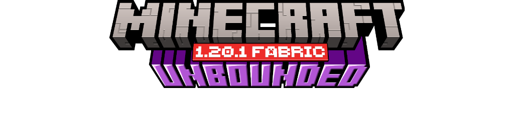

<<<<<<< HEAD

# 整合包介绍

在这款自由度很高的整合包，你无需跟着任务指引，发挥无界的思维，去创造无界的世界。

## 整合包说明

✨整合包由作者[MC星云](https://space.bilibili.com/205390148)制作。✨

整合包 '本体' 添加了107个模组。

你可以在此基础上👆，下载该整合包的模组包,将模组添加进本体，来扩展你的玩法。

## 最低配置要求

* 操作系统：Window 10 (64bit)
* CPU：Intel：i7—4790K | AMD：R5 3400G
* 内存：DDR3 1600MHZ 8GB
* 显卡：核显即可 (需关光影)
* 存储空间：

## 教程

视频版：
B站教程视频(点击蓝字👈)

文字版：
打开右上角的WIKI百科，阅读教程。

### 建筑

在各个维度添加了数十种建筑结构，如：

* 前哨站
* 烽火台
* 海底神殿柱
* 末地塔楼

### 生物

整合包中增加了一些陆地以及海洋中的生物，你还可以在本整合包中找到在历届生物投票中被淘汰的生物，如：

* 哞花
* 铜傀儡
* 怒目怪
* 冰术士

### 玩法

* 传送
* 盔甲革新
* 考古学拓展
* 赏金
* 祛魔

# 模组包说明

## 需求模块

模组包中有各式各样的争对玩家不同需求而创建的模块，如：

* 低配机模块 [专为电脑💻配置低的玩家而生]
* 服务端模块 [配合服务器端添加的模组]
* 联机模块 [让你的小伙伴👱‍♂️加入你的个人存档📂]
* 生电模块 [生电人狂喜！！]

## 游戏玩法模块

模组包中还有改变游戏玩法的模组，像：

* 农夫乐事
* 机械动力
* 更好的下界|末地
* 龙骑士
* 凡家物语
* 方块小镇

等等..

# 画廊

=======
<picture>
    
</picture>

# Minecraft-Unbounded
我的世界《无界》整合包
>>>>>>> 4aee9bc950ae57983c8fd9e8b8cae9ea1db09967
